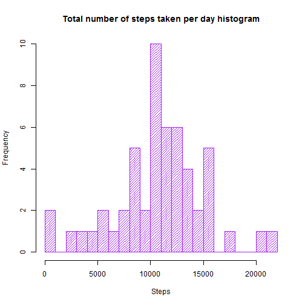
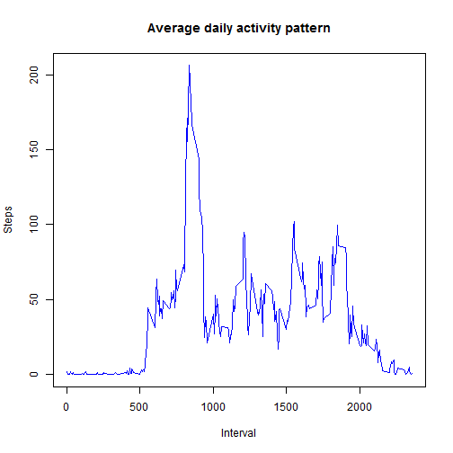
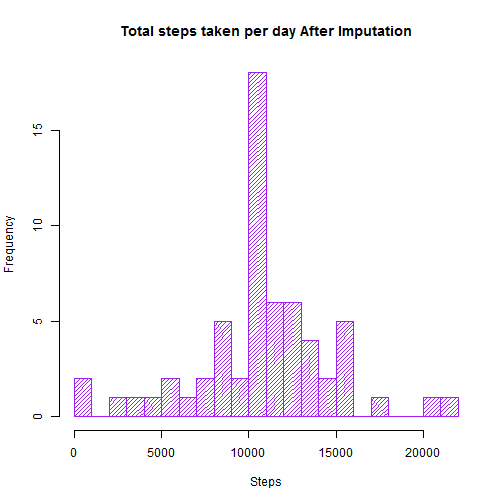
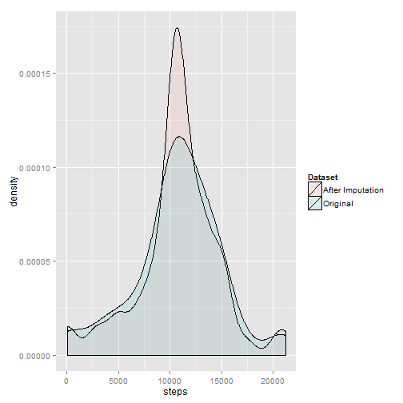
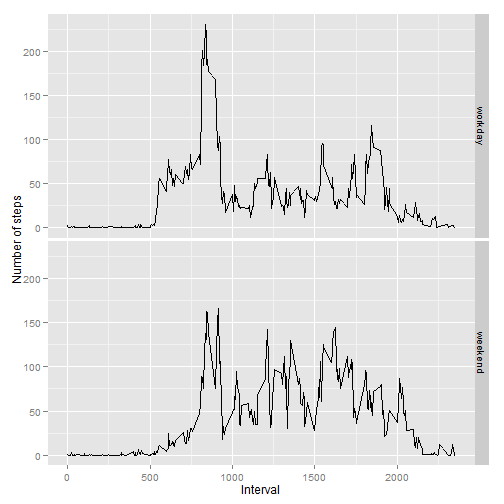

# Reproducible Research: Peer Assessment 1

## Loading and preprocessing the data

```r
  conn <- unz("activity.zip", "activity.csv");
  activity.measured.data <- read.csv(conn, na.string="NA");
  data <- activity.measured.data
  data$date <- as.Date(data$date,format="%Y-%m-%d");
```

## What is mean total number of steps taken per day?
Data aggregation by steps taken per day

```r
data.steps_per_day <- aggregate(steps~date, data, sum, na.action = na.omit);
```

For this figure we will be using base plot


```r
hist(x=data.steps_per_day$steps, 
       main="Total number of steps taken per day histogram",
       xlab="Steps",
       density = 25,
       breaks = 30,
       col="purple");
```

 

Calculation of the mean and median of total number of steps taken per day


```r
mean(data.steps_per_day$steps);
```

```
## [1] 10766
```


```r
median(data.steps_per_day$steps);
```

```
## [1] 10765
```


## What is the average daily activity pattern?


```r
data.mean.steps_per_interval <- aggregate(steps~interval, data, mean, na.action = na.omit);
```


```r
plot(data.mean.steps_per_interval$interval, 
       data.mean.steps_per_interval$steps, 
       type="l", 
       main="Average daily activity pattern", 
       xlab="Interval", 
       ylab="Steps",
       col="blue")
```

 

Visible pattern shows when number of steps is highest which might indicate when people go to work, having lunch break and going back home.

5-minute interval, on average across all the days in the dataset, contains the maximum number of steps.

```r
index <- which.max(data.mean.steps_per_interval[,2]);
data.mean.steps_per_interval[index,];
```

```
##     interval steps
## 104      835 206.2
```

## Imputing missing values
Calculate and report the total number of missing values in the dataset

```r
sum(is.na(data))
```

```
## [1] 2304
```

Filling in all of the missing values in the dataset. The strategy is to use the mean for that 5-minute interval


```r
replace.missing.value <- function(steps, interval) {
  if (!is.na(steps)){
    new.value <- steps;
  }
  else {
    new.value <- data.mean.steps_per_interval[data.mean.steps_per_interval$interval == interval, 2];
  }
  
  new.value
}
data.replaced <- data;
data.replaced$steps <- mapply(replace.missing.value,data$steps,data$interval);
```

Histogram of the total number of steps taken each day.


```r
data.replaced.steps_per_day <- aggregate(steps~date, data.replaced, sum);

hist(x=data.replaced.steps_per_day$steps, 
       main="Total steps taken per day After Imputation",
       xlab="Steps",
       density = 25,
       breaks = 30,
       col="purple");
```

 

Another way of presenting the difference between datasets


```r
data.replaced.steps_per_day$Dataset <- factor("After Imputation");
data.steps_per_day$Dataset <- factor("Original");


library(ggplot2);
merged <- rbind(data.replaced.steps_per_day,data.steps_per_day)
ggplot(merged, aes(steps, fill = Dataset)) + geom_density(alpha = 0.1,na.rm=T)
```

 

After imputation compare the mean and median


```r
mean(data.replaced.steps_per_day$steps);
```

```
## [1] 10766
```


```r
median(data.replaced.steps_per_day$steps);
```

```
## [1] 10766
```

## Are there differences in activity patterns between weekdays and weekends?

* Fill the dataset with weekdays
* Create two factors: workday and weekend
* Plot the figure


```r
data.replaced$weekday <- weekdays(data$date);

create.day.factor <- function(day) {
  day.factor <- "workday";
  if (day %in% c("Sunday","Saturday")) 
    day.factor <- "weekend";
  factor(day.factor);
}

data.replaced$day <- mapply(create.day.factor,data.replaced$weekday);
data.replaced.avarage.day <- aggregate(steps ~ interval + day, data.replaced, mean);
```


```r
ggplot(data.replaced.avarage.day, aes(interval, steps)) + 
  geom_line() + 
  facet_grid(day ~ .) + 
  xlab("Interval") + 
  ylab("Number of steps");
```

 

